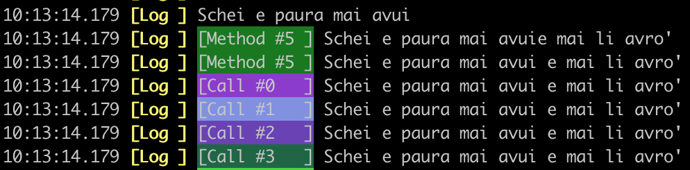

# Console
An easy to use C++ library that allows you to print colorful terminal messages, navigate inside your folder and list files, measure execution time and generate profiler file.

# Dependecies
This library depends on:
- boost filesystem
- [nlohman json](https://github.com/nlohmann/json)

# Installation
1. Install dependecies
On __MacOS__:
~~~bash
brew install nlohmann-json
brew install boost
~~~
On __Ubuntu__
~~~bash
sudo apt install nlohmann-json3-dev
sudo apt-get install libboost-all-dev
~~~

This project contains multiple useful libraries:
- [Console](console)
- [Browse](browse)
- [LogTimes](log-times)
- [Profiler](profiler)

## __Console__
Easy way to print something on the terminal. Where terminal message is composed by four __fields__.
  1. __Timestamp__ as HH:MM:SS.ms
  2. __Header__ define type of message like __Log__, __Info__, __Warn__, etc etc.
  3. __Sub-header__ (optional) which is user defined and can be colored.
  4. __Message__ which is the content of the message.

### Basic usage
~~~c++
// Default configuration
Debug::Console Debug;

// Overwrite default configuration
Debug::Console Debug(YELLOW, BOLD, DEFAULT, NORMAL);
// 1 - Header color
// 2 - Header type (bold, underlined, blink...)
// 3 - Text color
// 4 - Text type (bold, underlined, blink...)

// Save all message in a log file
Debug.SaveAllMessages(); // .log near executable file
// or
Debug.SaveAllMessages("/path/to/log/file.log");

// Print Info message
Debug.Info("message");   // HH:MM:SS.ms [Info] message
Debug.Error("message");  // HH:MM:SS.ms [Err ] message
Debug.Warn("message");   // HH:MM:SS.ms [Warn] message 
// Non persistent message 
Debug.Wait("message");   // HH:MM:SS.ms [Info] message 

// Set header and message
Debug.Info("Header", "message"); // HH:MM:SS.ms [Head] message 

~~~

### Advanced usage
~~~c++
// Static console (singleton)
// Configure
Debug::StaticConsole::Get().SaveAllMessages(); // Defualt near executable that initiate first.
Debug::StaticConsole::Get().SetDefault(YELLOW, BOLD, DEFAULT, NORMAL);

// Using operators
Debug << "message\n";  // HH:MM:SS.ms [Log ] message
// Brackets - define message
Debug("message");      // HH:MM:SS.ms [Log ] message
// Square brackets - define sub-header
Debug["sub-header"] << "message\n"; // HH:MM:SS.ms [Log ] [sub-header] message

// Using macro
// Simple log message
LOGGAMELO << "message\n"; // HH:MM:SS.ms [Log ] message
// Log message where sub-header is the function name (__PRETTY_FUNCTION__)
LOGHERE << "message\n";  // HH:MM:SS.ms [Log ] message
// Simple log message but more "thread-safe"
SAFELOG << "message" << FINI; // HH:MM:SS.ms [Log ] message
~~~

## __Browse__
Allows browing from terminal files in system.  

### Usage
~~~c++
Browse b;
b.SetSelectionType(SelectionType::sel_all);
b.Start();

b.SetMaxSelections(1);
b.SetExtension(".log");
b.SetSelectionType(SelectionType::sel_file);

b.Start();
~~~

Simple as that.
#### Options
- Extension
- Selection type
- Max selections

These are the three possible selection types:  
Every file type, only folders or only files.
~~~c++
SelectionType::sel_all;
SelectionType::sel_folder;
SelectionType::sel_file;
~~~

This function sets the only extension accepted when selecting files
~~~c++
SetExtension(".json");
~~~

To set a maximum number of files/folders selected:
~~~c++
SetMaxSelections(number);
~~~

## __Profiler__
Tool to time functions and output data to a json formatted file.
The result can be opened in Google Chorme tool.

### Usage
Initialize the profiler class:
~~~c++
PROFILER_START("Test")
PROFILER_START_PATH("Test","/home/res.json")               // To specify output path
// OR
Instrumentor::Get().BeginSession("Test");
Instrumentor::Get().BeginSession("Test","/home/res.json"); // To specify output path
~~~

***These two lines do the same thing, one uses macros.***

To time a block of code, place:
~~~c++
PROFILE("timer1")
// OR
InstrumentationTimer timer("timer1");
~~~
This code will time all the scope, so an example can be like this:
~~~c++
{
  PROFILE("Scope")
  function1();
}
function2();
~~~
Here only function1 will be profiled because is in the same scope of **PROFILE**

To end a session:
~~~c++
PROFILE_END
// Same as
Instrumentor::Get().EndSession();
~~~

### Displaying result
Open Google Chrome, in the topbar type ***chrome://tracing/***.

From there, load prof_result.json.

## __LogTimes__
Simple way to measure code execution time, make some stats and save results in a __.csv__ file. This library __is not__ suitable for multi-threaded applications.

### Usage
~~~c++
// Deafult configuration. Create DD_MM_YYYY__hh_mm_ss.logtimes file.
Debug::LogTimes Log;

// Cycle usage
while(!stop) {
  // Start measuing using a "key1"
  Log.StartByKey("key1");
  // Stuff you want to measure
  Log.StopByKey("key1");

  // Start measuing using a "key2"
  Log.StartByKey("key2");
  // Stuff you want to measure
  Log.StopByKey("key2");
  
  // Once cycle is finished
  Log.SumDtByKey(); 
  // Compute times and save them to output file
}

// Get statistics for all keys
// Get mean value and standard deviation for each key
vector<string> mean_val = Log.GetMeanAndStdDev(); 
// Get csv header
string header   = Log.GetStatHeader();
~~~
